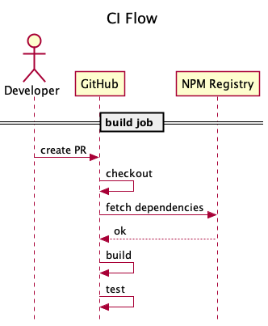
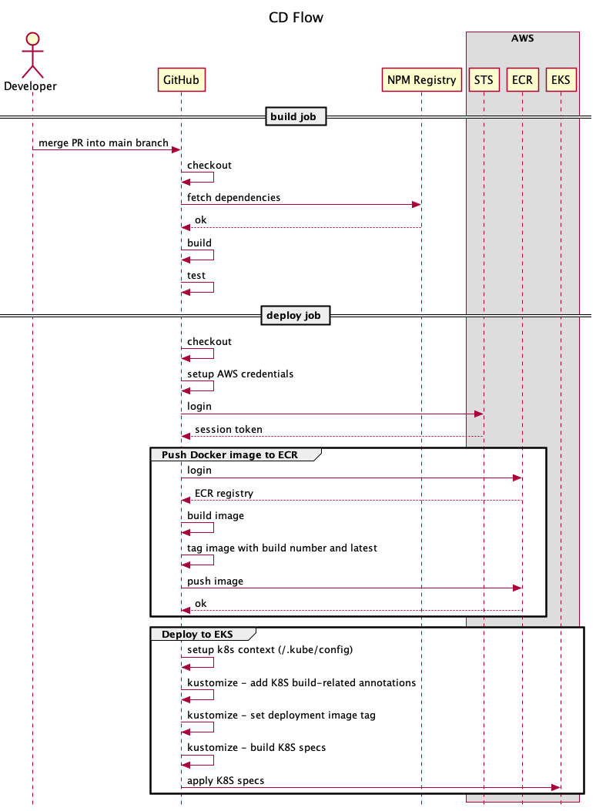

# CI/CD

CI/CD pipeline is implemented using GitHub Workflows.

The following workflows are defined under `.github/workflows`:

| Workflow | Purpose                                                                 | Jobs              |
| -------- | ----------------------------------------------------------------------- | ----------------- |
| `dev-ci` | runs for each `pull-request` to `main` in order to build-test the code. | `build`           |
| `dev-cd` | runs for each `push` to `main` in order to build-test-deploy the code.  | `build`, `deploy` |

Workflows were prefixed with `dev` in order to denote that the process is used to incrementally develop code which will land on a `dev` (development) environment.

Note that CI/CD depends on how each team agreed on branching strategy and release management.

## `dev-ci` Workflow

Runs for each PR (Pull Request) creation or update as long as its target is the `main` branch.

Main purpose is to validate PR before merging in order to act as an additional gate.

The `build` job runs for all Node apps in parallel.

## `dev-cd` Workflow

Runs for each push to `main` branch.

Main purpose is to validate current branch state and to act as an alarm for the team to take immediate measure in order to fix the issues which accidentally occurred on the `main` branch.

The `build` job runs for all Node apps in parallel.

The `deploy` job is concerned with building the Docker image, pushing it to ECR (registry), then applying K8S specs to EKS cluster which takes over and allocates resources for starting the actual image pushed to ECR.

